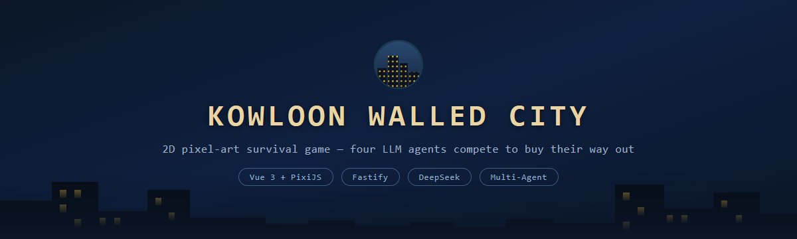
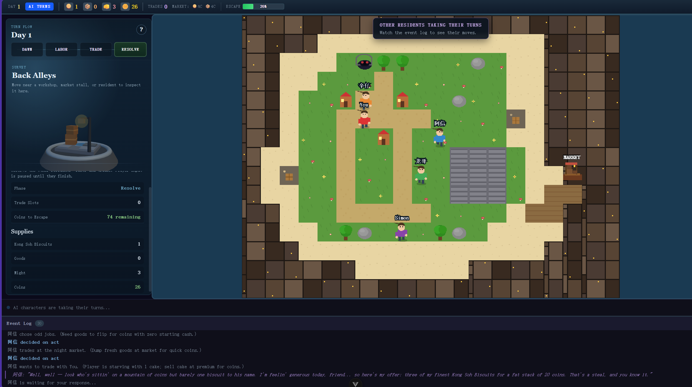
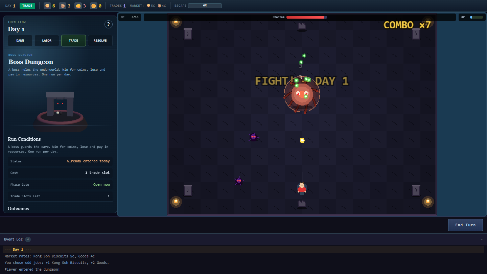

<div align="center">



[](LICENSE)
[](https://nodejs.org)
[](https://vuejs.org)
[](https://fastify.dev)

[**Quick Start**](#quick-start) · [**The Idea**](#the-idea) · [**Meet the Residents**](#meet-the-residents) · [**Architecture**](#architecture)

</div>

You wake up in the Kowloon Walled City with four strangers and one way out: 100 Coins to buy your freedom before the food runs out. You take odd jobs, you practice kung fu, you haggle. So do they. The catch is that the four other residents are large language models, and they hold grudges, form alliances, and have been known to quietly stop giving you good deals right when you're one trade away from winning.

**Kowloon Walled City** is a 2D pixel-art survival trading game where every non-player character is driven by an LLM, and a small typed game engine keeps all of them honest.



## The Idea

Most "AI in games" bolts a chatbot onto an NPC and hopes the model stays in character. The problem is that a model will happily invent Coins it doesn't have, accept a trade it can't pay for, or narrate itself to victory. Once the model can touch the rules, the economy falls apart.

So this project splits responsibility down the middle:

| The LLM owns | The game engine owns |
|---|---|
| **Intention** — what an NPC actually wants this turn | **Resources** — every Coin, biscuit, crate of Goods, and point of Might |
| **Dialogue** — how it says it, in natural language | **Phases** — labor, trade, settlement, day rollover |
| **Personality** — cautious, aggressive, cooperative, cunning | **Trade execution** — validate the deal, then transfer |
| **Bargaining style** — generous, or a hard no | **Win / loss** — elimination and escape |

The model proposes; the engine disposes. Every action an NPC wants to take is a structured proposal validated against a [Zod](https://zod.dev) schema before a single resource moves. If the model hallucinates a trade it can't afford, the engine rejects it and the world stays consistent. The result is the line the whole project is built around:

> The model creates the expression; the typed game engine owns the rules.

## Meet the Residents

Four NPCs, four system prompts, four very different ways to do business. Here they are answering the *exact same* opening offer — "I'll buy 3 Kong Soh Biscuits for 10 Coins":


| Character | Personality | How they play |
|-----------|-------------|---------------|
| **辛仔** | Guarded Lone Wolf | Hoards Kong Soh Biscuits because they are what keeps him alive. Cold and stingy until you earn his trust, then fiercely loyal. Splits his days evenly between odd jobs and kung fu — never quite committing to either |
| **阿信** | Bold Street Player | A charming gambler and natural local kingpin. Flips resources fast even at slim margins, and spends most of his days practicing kung fu so he arrives at the table strong rather than often |
| **龙哥** | Patient Big Player | Calm and pragmatic, plays the long game. Builds alliances through generous trades, remembers who betrayed him, and prefers the steady income of odd jobs |
| **Simon** | Cautious Hacker | Watches from the dark and profits from information asymmetry. Never reveals his real resources, offers "generous" deals that favor him, and is the most dangerous trader in the city |

Friendship is real state, not flavor text. Successful trades raise an NPC's regard for you, which shifts their prices, their willingness to deal, and who they'll team up with. Burn someone late in the game and the city remembers.

## How a Negotiation Works

Walk up to a resident, press **E**, and you're in a conversation. You can use a quick-trade template or just type what you want. Each exchange round is a real LLM call; the model reads the game state, its own personality, its friendship level with you, and the conversation so far, then comes back with a reply and a structured proposal you can accept, counter, or reject.

<div align="center"></div>

```
You send a message  →  NPC thinks (LLM call)  →  NPC replies with a proposal  →  Accept / Counter / Reject
```

A conversation runs up to five exchanges and costs one trade slot whether or not you close a deal, so opening your mouth has a price. The proposal that comes back is never trusted on faith: it's parsed, schema-checked, and only executed if both sides can actually pay.

## The Daily Loop

Each day moves through fixed phases, for you and for every AI in turn:

1. **Day start** — the night market opens with fresh random prices, and a random daily event may change the rules.
2. **Labor** (mandatory) — take **odd jobs** for **+1 Kong Soh Biscuits and +2 Goods**, or **practice kung fu** for **+1 Might**.
3. **Trade** (2 slots) — sell to the market for Coins, or negotiate with the other residents.
4. **AI turns** — each of the four LLM agents labors, then spends its own trade slots however it decides.
5. **Settlement** — everyone eats **1 Kong Soh Biscuits**. Run out and you're eliminated.
6. **Escape** — first to **100 Coins** buys their way out and wins.

**The numbers that matter**

| | |
|---|---|
| Starting supplies | 5 Kong Soh Biscuits + 3 Might |
| Nightly cost | 1 Kong Soh Biscuits (2 during a famine) |
| Odd jobs | +1 Kong Soh Biscuits, +2 Goods |
| Kung fu practice | +1 Might |
| Biscuit price | 2–6 Coins (random daily) |
| Goods price | 1–4 Coins (random daily) |
| Trade slots | 2 per day |
| Win condition | 100 Coins |

Coins only come from the night market, and the market only pays for Kong Soh Biscuits and Goods — Might puts nothing on the table. That single bottleneck is what forces everyone to the negotiating table.

**Daily events** roll at dawn and bend the rules for one day: a **downpour** halves what odd jobs yield, a **festival** doubles friendship gains, a **windfall** or a **cargo spill** hands everyone free resources, and a **famine** doubles the night's upkeep.

## Boss Dungeon

There's a faster, riskier road to those Coins. Once a day you can spend a trade slot to enter the dungeon and fight the **Giant Crab**, a bullet-hell boss with a 150-HP state machine that escalates through three phases. It opens with aimed four-bullet volleys, then adds spinning ring barrages and summoned minions as its health drops, and in its final quarter throws eight-bullet volleys, denser rings, and a faster charge. The boss also scales with the day, so later runs hit harder.



- **Enter:** costs 1 trade slot, once per day
- **Win:** +15 Coins, scaling up the longer you've survived (capped at 80)
- **Lose:** up to −5 Kong Soh Biscuits and −5 Goods (you always keep at least 1 of each)
- **Cards:** land hits to earn XP, then pick 1 of 3 upgrades (Multi Shot, Piercing, Heal, and more) from a pool of 15

It turns every day into a real decision: play the market safely, or gamble resources you might need to survive the night for a shortcut to escape.

## Architecture

The server is the single source of truth. The browser sends *actions*; the backend validates them, advances the state machine, and streams the result back over SSE. Nothing the frontend or an LLM says is trusted until the engine has checked it.


| Layer | Technology |
|-------|-----------|
| Frontend | Vue 3 + TypeScript + Vite + Pinia + Tailwind CSS v4 |
| 2D world | PixiJS — tile map, characters, A\* pathfinding on an HTML5 canvas |
| 3D preview | Three.js — WebGL scene for character/model previews |
| Backend | Fastify + Zod + Drizzle ORM + SQLite |
| Game engine | Pure-function state machine with Zod-validated transitions |
| AI agents | OpenAI-compatible API (DeepSeek via OpenRouter by default) |
| Shared | Zod schemas in `packages/shared`, one contract for web and server |

```
.
├── apps/
│   ├── web/                 # Vue 3 frontend with the PixiJS game canvas
│   │   ├── src/game/        # PixiJS: tile map, characters, input, world
│   │   ├── src/components/  # Vue: HUD, ActionMenu, DialoguePanel, EventLog
│   │   ├── src/stores/      # Pinia game store + SSE handling
│   │   └── src/composables/ # API helpers
│   └── server/              # Fastify backend
│       ├── src/engine/      # Game state machine (pure functions)
│       ├── src/agents/      # LLM layer: decision, negotiation, personalities
│       ├── src/routes/      # REST + SSE endpoints
│       └── src/db/          # Drizzle + SQLite persistence
└── packages/
    └── shared/              # Zod schemas shared between web and server
```

Because the engine is pure functions over typed state, it's straightforward to test without ever calling a model.

That shared schema is also what keeps the fiction from leaking into the engine. Storage keys stay stable and English (`cake`, `goods`, `might`; `work`, `train`) while display names live in one registry (`RESOURCE_LABELS`, `LABOR_LABELS`) that the server, the UI, the prompts, and even the client's log parsing all read from. Re-theming the setting a third time would touch those tables and almost nothing else.


```bash
pnpm test
```

## Quick Start

Requirements: **Node.js >= 22.12** and **pnpm** (via Corepack).

```bash
corepack enable pnpm
corepack use pnpm@latest-10
pnpm install
cp .env.example .env
```

Open `.env` and drop in any OpenAI-compatible key. The default points at OpenRouter with DeepSeek, which is cheap and fast enough for in-game dialogue:

```
OPENAI_API_KEY=<your-openrouter-or-openai-key>
OPENAI_BASE_URL=https://openrouter.ai/api/v1
OPENAI_MODEL=deepseek/deepseek-chat
DB_FILE_NAME=file:local.db
LOG_LEVEL=info
```

Then run it:

```bash
pnpm dev
```

- **Frontend:** http://localhost:5173
- **Backend:** http://localhost:8787

Open the frontend, click **NEW GAME**, and you're in the city. If NPC replies feel slow, that's the model API thinking — the game state and the rules are validated locally and stay correct regardless.

For a single-process production build, `pnpm build && pnpm start` serves both the API and the built web app from Fastify; set `HOST=0.0.0.0` and `PORT=<port>` when deploying.

## How to Play

1. Open http://localhost:5173 and click **NEW GAME**.
2. **WASD** to move around the walled city.
3. **E** to interact — workshops, the martial arts hall, the night market, or another resident.
4. **Labor first** (odd jobs or kung fu) — it's mandatory each day.
5. **Then trade** — sell to the market, or walk up to a resident and negotiate.
6. Click **End Turn** and watch the four AIs take theirs.
7. Survive the nightly drain and be the first to 100 Coins.

## API

| Method | Path | Description |
|--------|------|-------------|
| POST | `/api/games` | Create a new game (accepts an optional `seed`) |
| POST | `/api/games/:id/replay` | Start a fresh run with the same seed as an existing game |
| GET | `/api/games/:id` | Get current game state |
| POST | `/api/games/:id/action` | Submit a player action |
| GET | `/api/games/:id/stream` | SSE stream of real-time AI-turn updates |

Runs are seeded and deterministic: game logic draws from a `mulberry32` PRNG rather than `Math.random`, so the same seed and the same player actions produce the same market prices, the same daily events, and the same NPC decisions.

## Roadmap

What plays end-to-end today is the full loop: daily phases, the market economy, LLM-driven negotiation, the boss dungeon, and elimination. The honest limitations, and where it goes next:

- **Might has no sink yet.** You can spend a day practicing kung fu, but nothing spends the Might you earn. Using it to *force* a trade — take what you want from a weaker resident — is the next mechanic, and it's what will make the fourth resource mean something.
- **NPC memory** — agents reason over the current state and the live conversation, but don't yet carry long-term memory across many days. Deeper memory is the biggest lever on how "alive" they feel.
- **Economy ↔ dungeon balance** — the safe market path and the risky dungeon path need tuning so neither dominates.
- **Pacing** — LLM latency shapes turn rhythm; batching and local-model support would smooth it out.
- **Local-model mode** — run NPC dialogue against a local model (e.g. Ollama) so the game is fully playable without a hosted key.
- **Save and resume**, and a real **difficulty curve** across early and late game.
- **Real-time multiplayer**, so the residents aren't the only ones who can gang up on you.

## References

- [Generative Agents (Park et al., 2023)](https://arxiv.org/abs/2304.03442) — believable LLM-agent behavior
- [Project Sid (2024)](https://arxiv.org/abs/2411.00114) — emergent economies in multi-agent simulations
- [AI Town (a16z)](https://github.com/a16z-infra/ai-town) — open-source LLM agent simulation

## Credits

Kowloon Walled City is a re-theme of [IslandEscape](https://github.com/he-yufeng/IslandEscape) (MIT), an open-source LLM-agent survival game. The engine, the agent layer, and the PixiJS/Three.js presentation come from that project; the setting, the resource and labour model, the economy numbers, the presentational layer, and the cast are what changed here.

## License

MIT
